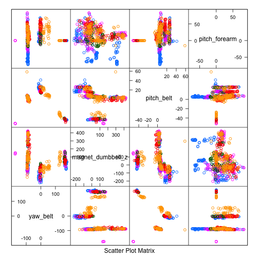

# Practical Machine Learning- Course Project 
Khansa Irem
April, 2018

# Introduction 
Using devices such as Jawbone Up, Nike FuelBand, and Fitbit it is now possible to collect a large amount of data about personal activity relatively inexpensively. These type of devices are part of the quantified self movement—a group of enthusiasts who take measurements about themselves regularly to improve their health, to find patterns in their behavior, or because they are tech geeks. One thing that people regularly do is quantify how much of a particular activity they do, but they rarely quantify how well they do it. In this project, your goal will be to use data from accelerometers on the belt, forearm, arm, and dumbell of 6 participants. They were asked to perform barbell lifts correctly and incorrectly in 5 different ways. More information is available from the website here: http://groupware.les.inf.puc-rio.br/har (see the section on the Weight Lifting Exercise Dataset).

# Data Processing 
## Load the Data
In this section, load the data and the 20 cases that will be submitted to coursera.


```r
library(ggplot2)
library(caret)
library(klaR)
library(rpart)
library(gbm)
library(randomForest)

rm(list = ls())
if (!file.exists("pml-training.csv")) {
  download.file("http://d396qusza40orc.cloudfront.net/predmachlearn/pml-training.csv", destfile = "pml-training.csv")
}
if (!file.exists("pml-testing.csv")) {
  download.file("http://d396qusza40orc.cloudfront.net/predmachlearn/pml-testing.csv", destfile = "pml-testing.csv")
}
submit <- read.csv("pml-testing.csv", sep = ",", na.strings = c("", "NA"))
data <- read.csv("pml-training.csv", sep = ",", na.strings = c("", "NA"))
```

## Cleanup the data
Here, I remove columns full of NAs and remove features that are not in the submit set. The features containing NAs are the variance, mean and stddev within each window for each feature. Since the submit dataset has no time-dependence, these values are useless and can be disregarded. I also remove the first 7 features since they are related to the time-series or are not numeric.


```r
# Remove columns full of NAs.
features <- names(submit[,colSums(is.na(submit)) == 0])[8:59]
# Only use features used in submit cases.
data <- data[,c(features,"classe")]
submit <- submit[,c(features,"problem_id")]
```

# Bootstrap
Next, I withhold 25% of the dataset for testing after the final model is constructed.


```r
set.seed(916)
inTrain = createDataPartition(data$classe, p = 0.75, list = F)
training = data[inTrain,]
testing = data[-inTrain,]
```

# Feature Selection
Some features may be highly correlated. The PCA method mixes the final features into components that are difficult to interpret; instead, I drop features with high correlation (>90%).


```r
outcome = which(names(training) == "classe")
highCorrCols = findCorrelation(abs(cor(training[,-outcome])),0.90)
highCorrFeatures = names(training)[highCorrCols]
training = training[,-highCorrCols]
outcome = which(names(training) == "classe")
```

# Feature Importance
The random forest method reduces overfitting and is good for nonlinear features. First, to see if the data is nonlinear, I use the random forest to discover the most important features. The feature plot for the 4 most important features is shown.


```r
fsRF = randomForest(training[,-outcome], training[,outcome], importance = T)
rfImp = data.frame(fsRF$importance)
impFeatures = order(-rfImp$MeanDecreaseGini)
inImp = createDataPartition(data$classe, p = 0.05, list = F)
featurePlot(training[inImp,impFeatures[1:4]],training$classe[inImp], plot = "pairs")
```



The most important features are:

**1.** pitch_belt
**2.** yaw_belt
**3.** total_accel_belt
**4.** gyros_belt_x

# Training
Train using the random forest and k-nearest neighbors for comparison.


```r
ctrlKNN = trainControl(method = "adaptive_cv")
modelKNN = train(classe ~ ., training, method = "knn", trControl = ctrlKNN)
ctrlRF = trainControl(method = "oob")
modelRF = train(classe ~ ., training, method = "rf", ntree = 200, trControl = ctrlRF)
resultsKNN = data.frame(modelKNN$results)
resultsRF = data.frame(modelRF$results)
```

# Testing Out-of-sample error
The random forest will give a larger accuracy compared to k-nearest neighbors. Here, I give the confusion matrix between the KNN and RF models to see how much they agree on the test set, then I compare each model using the test set outcomes.


```r
fitKNN = predict(modelKNN, testing)
fitRF = predict(modelRF, testing)
```

## KNN vs. RF

 
 
## KNN vs. test set

 

## RF vs. test set

 
 
The random forest fit is clearly more accurate than the k-nearest neighbors method with 99% accuracy.

# Submit
Finally, I use the random forest model to preduct on the 20 cases submitted to coursera.


